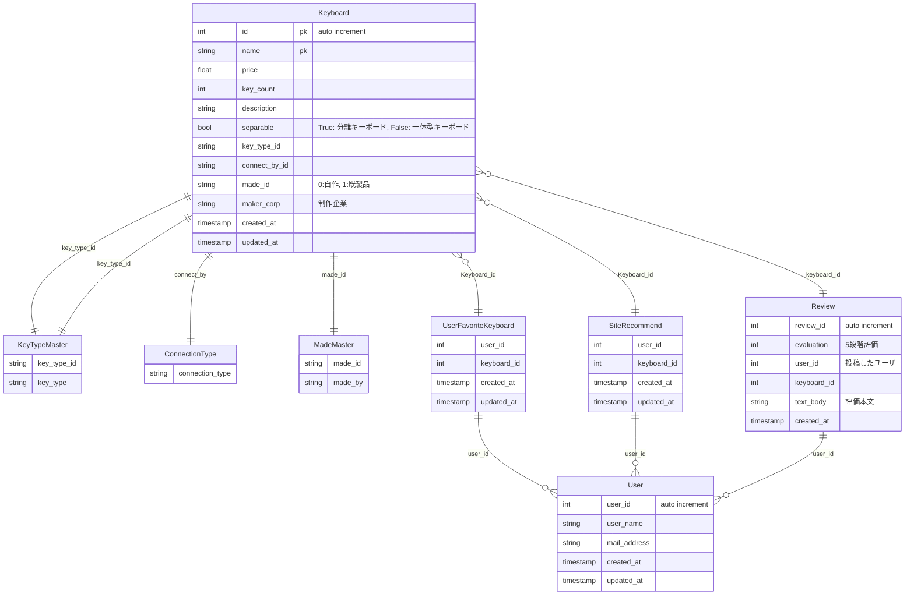

<!--
    WirelessKeyboard {
        string connection_type
        int battery_life
        string bluetooth_version
    }

    KeySwitch {
        string name
        string type
        int durability
        string key_press_sensitivity
    }

    MechanicalKeyboard {
        bool hot-swappable
    }

    MembraneKeyboard {
        bool water_proof
        string touch_sensitivity
    }

    CapacitiveKeyboard {
        string made_by
    }
 -->
