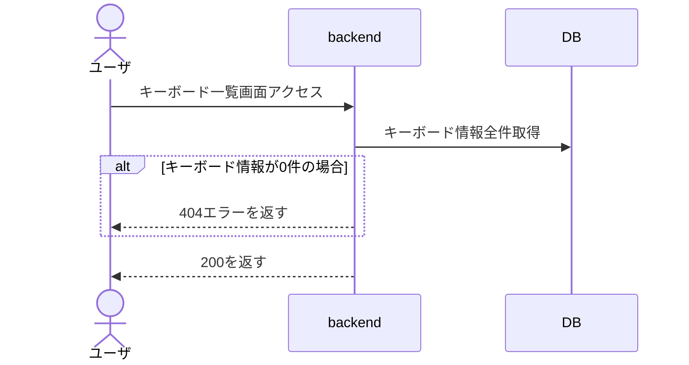
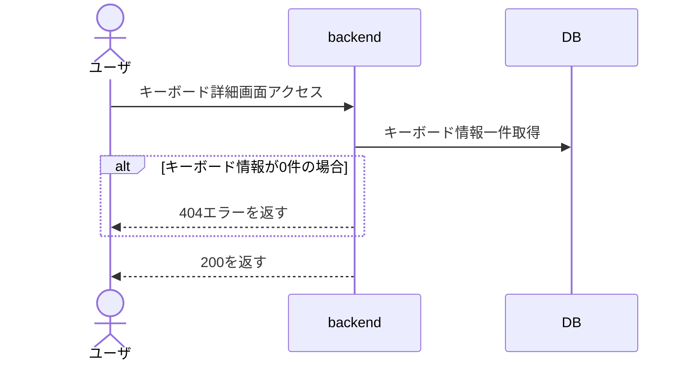
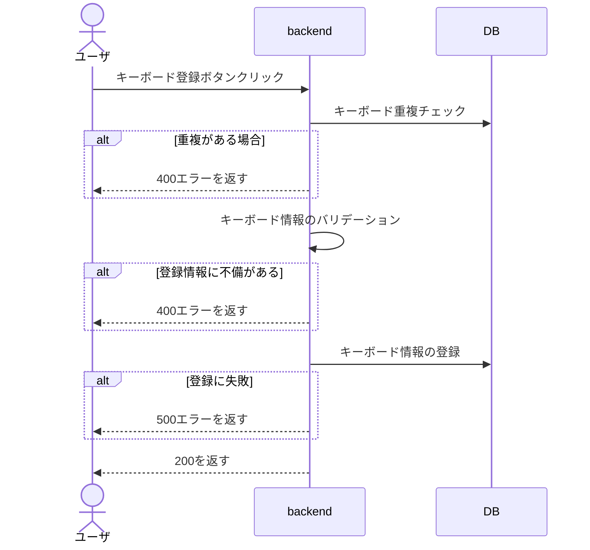
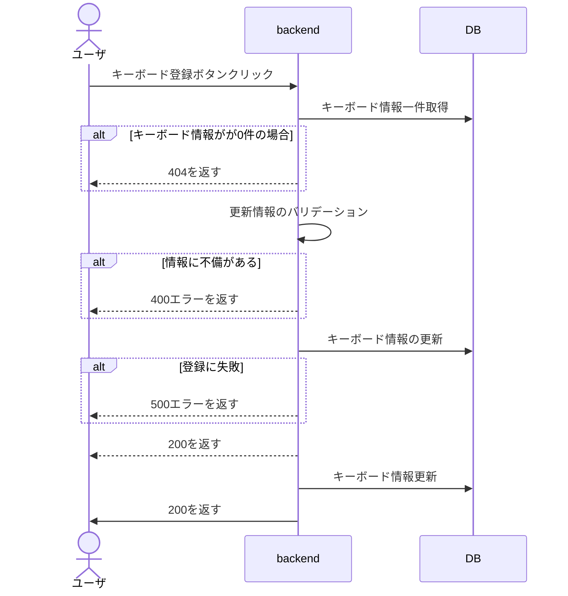
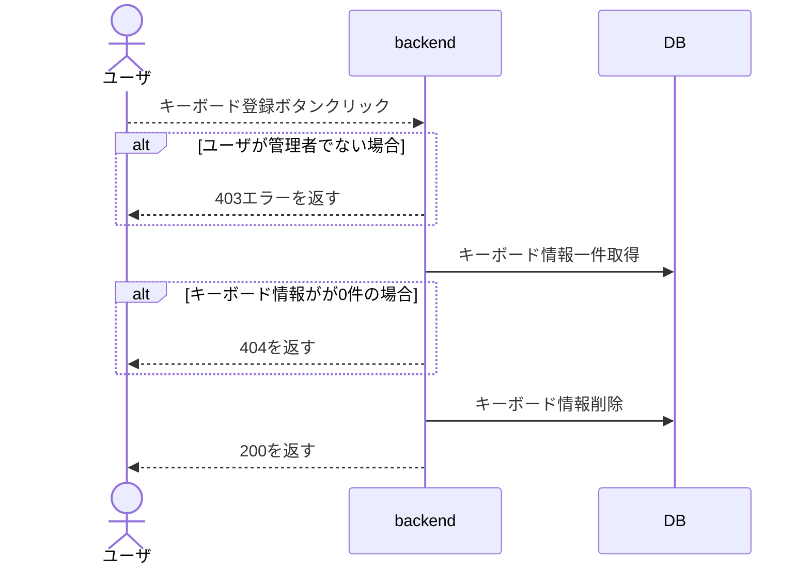
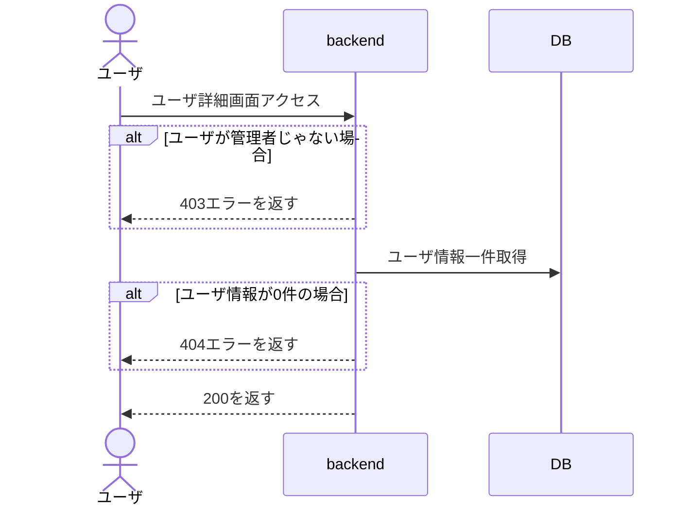
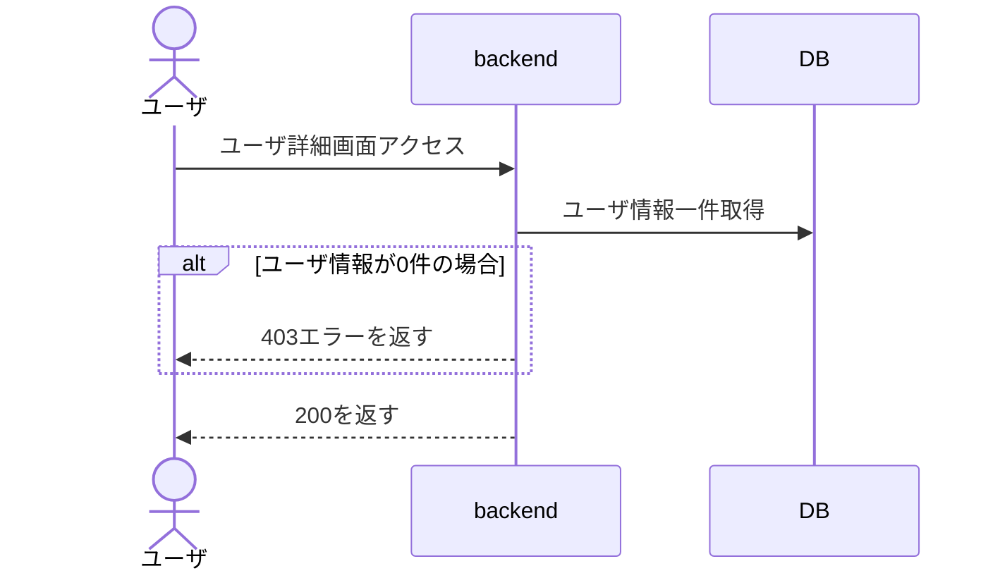
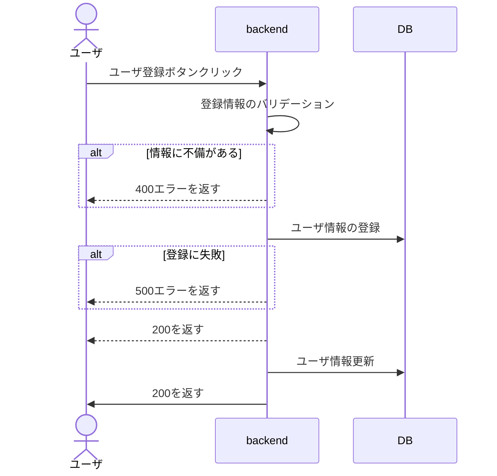
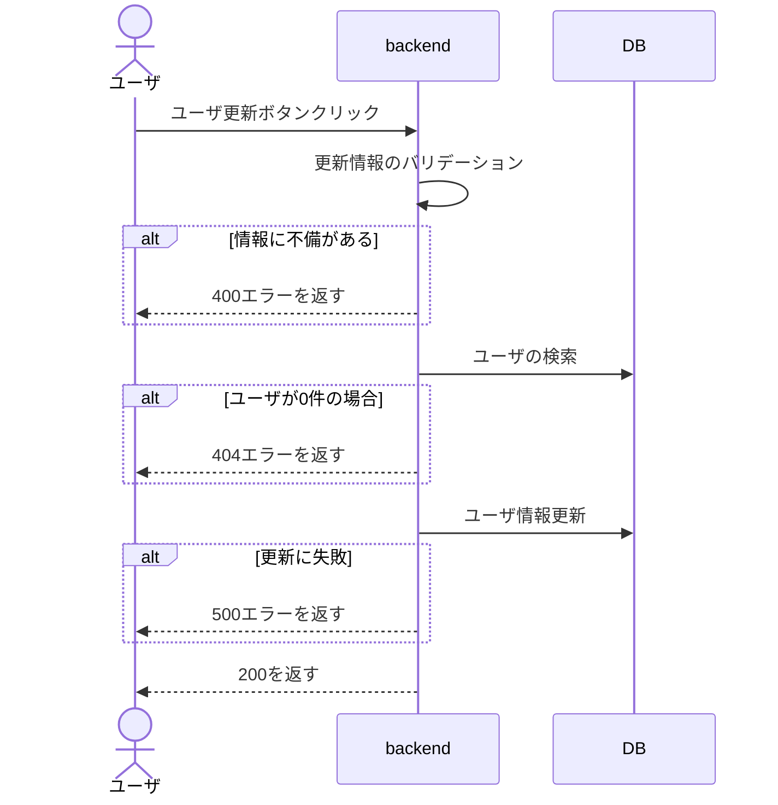
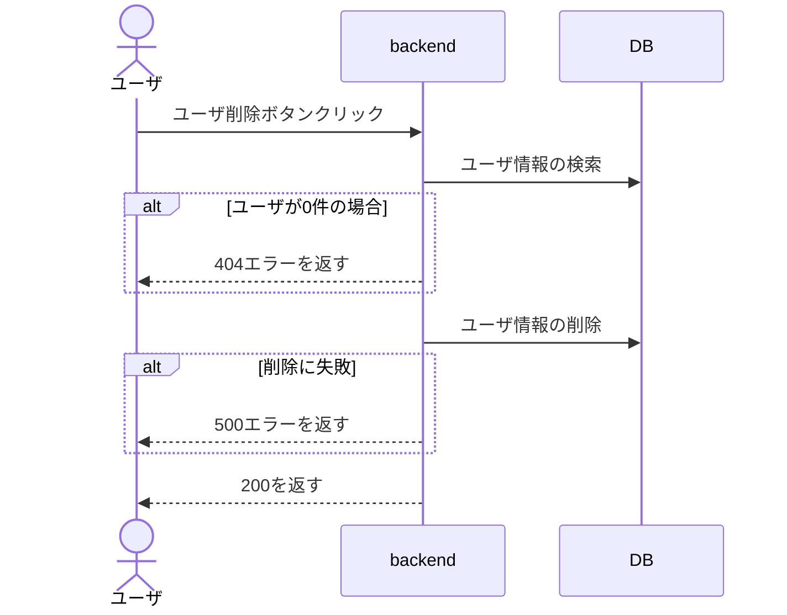

### backend 一覧

-   キーボード関連
    -   [キーボード情報登録](#キーボード情報登録)
    -   [キーボード情報全取得](#キーボード情報全取得)
    -   [キーボード情報一件取得](#キーボード情報一件取得)
    -   [キーボード情報更新](#キーボード情報更新)
    -   [キーボード情報削除](#キーボード情報削除)

 
## のちのち

-   ユーザー関連
    -   [ユーザ情報登録](#ユーザ情報登録)
    -   [ユーザ情報全権取得](#ユーザ情報全権取得)
    -   [ユーザ情報一件取得](#ユーザ情報一件取得)
    -   [ユーザ情報更新](#ユーザ情報更新)
    -   [ユーザ情報削除](#ユーザ情報削除)

### キーボード情報全権取得(all)\_GET

### キーボード情報一件取得(all)

### キーボード情報登録(all / admin)\_POST

### キーボード情報更新（admin）\_PUT

### キーボード情報削除(admin)\_DELETE

---

## ユーザ関連

### ユーザ情報全権取得（admin）

### ユーザ情報一件取得(all)

### ユーザ情報登録(all / admin)

### ユーザ情報更新(all)\_PUT

### ユーザ情報削除(all / admin)\_DELETE

