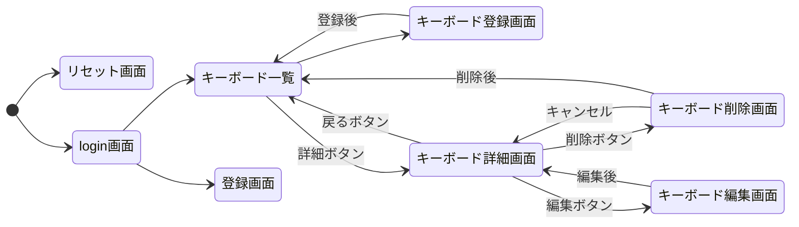

## 画面遷移図

```mermaid
stateDiagram-v2

    direction LR

    [*] --> リセット画面
    [*] --> login画面
    login画面 --> キーボード一覧
    login画面 --> 登録画面
    キーボード一覧 --> キーボード登録画面
    キーボード登録画面 --> キーボード一覧: 登録後
    キーボード一覧 --> キーボード詳細画面: 詳細ボタン


    キーボード詳細画面 --> キーボード削除画面: 削除ボタン
    キーボード詳細画面 --> キーボード編集画面: 編集ボタン
    キーボード編集画面 --> キーボード詳細画面: 編集後
    キーボード削除画面 --> キーボード詳細画面: キャンセル
    キーボード削除画面 --> キーボード一覧: 削除後

    キーボード詳細画面 --> キーボード一覧: 戻るボタン

```

### 共通画面

-   ヘッダー
    -   ホーム画面(ロゴ)
    -   検索バー
-   共通パーツ
    -   ユーザ情報
    -   ログアウト
-   menu
    -   キーボード新規登録
    -   キーボード一覧
